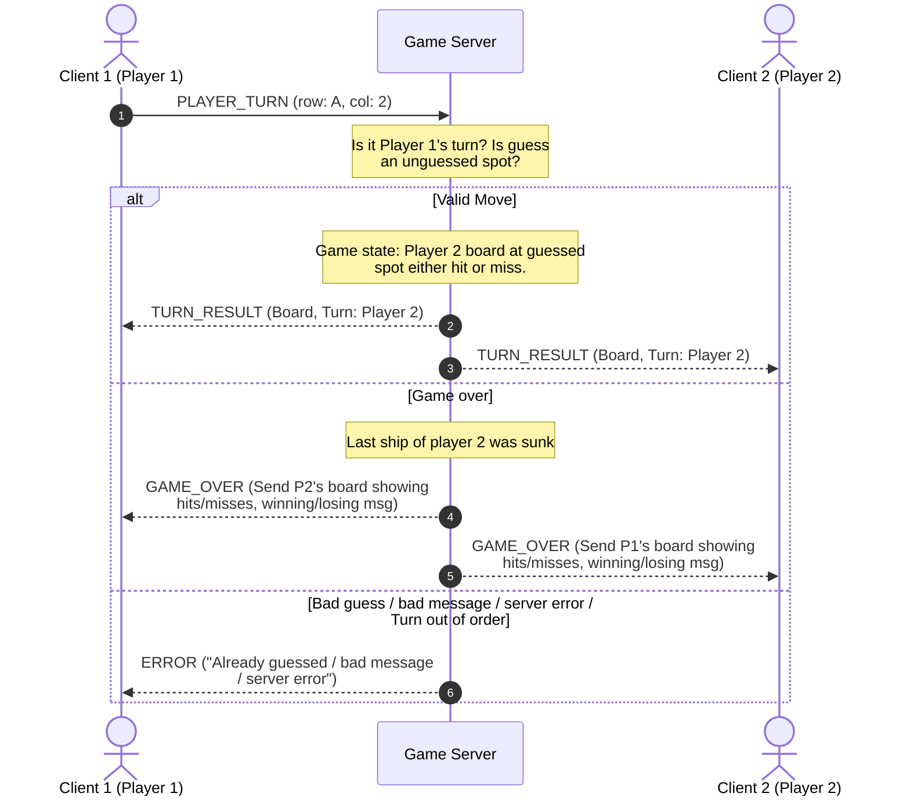

```mermaid
sequenceDiagram
    autonumber
    actor Client1 as Client 1 (Player 1)
    participant Server as Game Server
    actor Client2 as Client 2 (Player 2)

    Client1->>Server: PLAYER_TURN (row: A, col: 2)
    Note over Server: Is it Player 1's turn? Is guess<br>an unguessed spot?
    alt Valid Move
        Note over Server: Game state: Player 2 board at guessed <br>spot either hit or miss.
        Server-->>Client1: TURN_RESULT (Board, Turn: Player 2)
        Server-->>Client2: TURN_RESULT (Board, Turn: Player 2)
    else Game over
        Note over Server: Last ship of player 2 was sunk
        Server-->>Client1: GAME_OVER (Send P2's board showing<br>hits/misses, winning/losing msg)
        Server-->>Client2: GAME_OVER (Send P1's board showing<br>hits/misses, winning/losing msg)
    else Bad guess / bad message / server error / Turn out of order
        Server-->>Client1: ERROR ("Already guessed / bad message <br>/ server error")
    end
```
