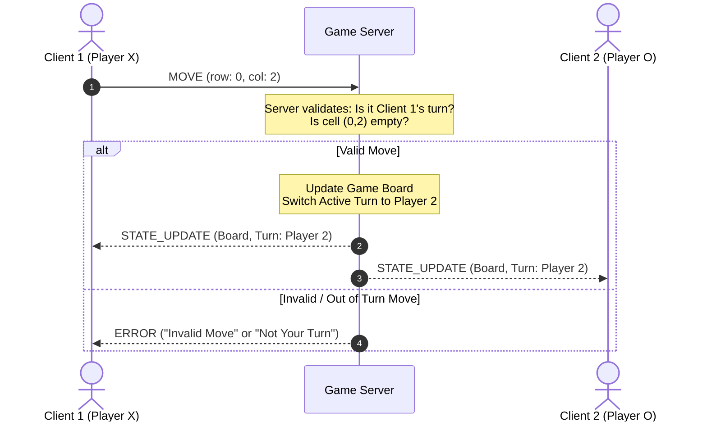

```mermaid
sequenceDiagram
    autonumber
    actor Client1 as Client 1 (Player X)
    participant Server as Game Server
    actor Client2 as Client 2 (Player O)

    Client1->>Server: MOVE (row: 0, col: 2)
    Note over Server: Server validates: Is it Client 1's turn?<br>Is cell (0,2) empty?
    alt Valid Move
        Note over Server: Update Game Board<br>Switch Active Turn to Player 2
        Server-->>Client1: STATE_UPDATE (Board, Turn: Player 2)
        Server-->>Client2: STATE_UPDATE (Board, Turn: Player 2)
    else Invalid / Out of Turn Move
        Server-->>Client1: ERROR ("Invalid Move" or "Not Your Turn")
    end
```
